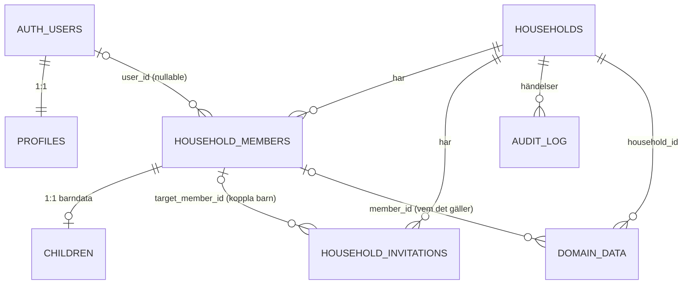

# Datamodell – kärna (Milestone 1)

> Status: **Förslag – väntar på godkännande.** Det här är designunderlag. SQL
> skrivs först efter godkännande, i `supabase/migrations/`.

## 1. Relationer



I text:

- **auth.users → profiles (1:1).** Kontot och användarens egna inställningar.
  Profilen tillhör användaren, inte något hushåll.
- **auth.users → household_members (0..n).** En användare kan vara medlem i
  flera hushåll, men bara en gång per hushåll.
- **households → household_members (1..n).** Ett medlemskap är en **person i
  hushållet**. För `managed_child` är `user_id` NULL.
- **household_members → children (0..1).** Barnspecifika uppgifter (födelsedatum,
  barnbehörigheter) ligger i en tilläggstabell. Gäller båda barnrollerna.
- **households → household_invitations (0..n).** En inbjudan kan via
  `target_member_id` gälla ett befintligt `managed_child`, så att ett konto kopplas
  till barnet.
- **All framtida domändata** har `household_id NOT NULL`. Vem posten gäller
  anges med `*_member_id`, inte med `auth.users.id`.
- **Användar-id förekommer bara som spårbarhet** (`created_by`, `actor_user_id`).
  Aldrig som ägare av gemensam data.

### Varför person-id och inte användar-id?

Specifikationen kräver att ett `managed_child` senare kan få ett konto **utan att
historiken försvinner**. Om rutiner, kalender och veckopeng refererade
användar-id skulle barnets historik behöva flyttas när kontot kopplas.
Med `household_members.id` som stabil person-id ändras bara medlemsraden:

```
före:  household_members { id: M1, user_id: NULL,  role: managed_child }
efter: household_members { id: M1, user_id: U42,   role: child }
       → alla rutiner/aktiviteter/veckopeng som pekar på M1 följer automatiskt med
```

## 2. Tabeller

Gemensamt för alla tabeller: `created_at timestamptz not null default now()`,
`updated_at timestamptz not null default now()` (uppdateras av en trigger),
UUID-primärnycklar (`gen_random_uuid()`) om inget annat anges, RLS aktiverat.

### 2.1 `profiles`

| Kolumn | Typ | Regel |
|---|---|---|
| `id` | `uuid` PK | FK → `auth.users(id)` on delete cascade |
| `display_name` | `text` not null | 1–80 tecken |
| `avatar_path` | `text` null | Sökväg i Storage, aldrig en publik URL |
| `locale` | `text` not null default `'sv-SE'` | |
| `last_active_household_id` | `uuid` null | FK → `households` on delete set null. **Bara en bekvämlighet, används aldrig för behörighet** |

- Skapas av en trigger på `auth.users` insert. Triggern hålls minimal: om den
  fallerar går det inte att registrera sig.
- Hushållskamrater läser **inte** `profiles`. I ett hushåll visas
  `household_members.display_name`.

### 2.2 `households`

| Kolumn | Typ | Regel |
|---|---|---|
| `id` | `uuid` PK | |
| `name` | `text` not null | 1–80 tecken, trimmat |
| `timezone` | `text` not null default `'Europe/Stockholm'` | Valideras mot `pg_timezone_names` |
| `currency` | `char(3)` not null default `'SEK'` | `^[A-Z]{3}$` |
| `created_by` | `uuid` null | FK → `auth.users` on delete set null |

- Skapas **endast** via RPC `create_household(name)`. Den skapar i samma
  transaktion hushållet, en `owner`-medlem för anroparen och en audit-händelse.
- Inställningar för budget och abonnemang läggs i egna tabeller i senare
  milestones, så att `households` hålls smal.

### 2.3 `household_members`

| Kolumn | Typ | Regel |
|---|---|---|
| `id` | `uuid` PK | **Stabil person-id** som all domändata refererar |
| `household_id` | `uuid` not null | FK → `households` on delete cascade |
| `user_id` | `uuid` null | FK → `auth.users` (on delete restrict, se nedan) |
| `role` | `member_role` not null | `owner`, `adult`, `child`, `managed_child` |
| `status` | `member_status` not null default `'active'` | `active`, `left`, `removed` |
| `display_name` | `text` not null | Namnet i familjen, 1–50 tecken |
| `color` | `text` null | `^#[0-9A-Fa-f]{6}$` |
| `avatar_path` | `text` null | Storage-sökväg `households/{household_id}/members/{id}` |
| `joined_at` | `timestamptz` not null default now() | |
| `ended_at` | `timestamptz` null | Sätts vid `left`/`removed` |
| `created_by` | `uuid` null | FK → `auth.users` on delete set null |

Constraints:

- `unique (household_id, user_id)` – en användare har max ett medlemskap per
  hushåll. Den som går med igen får sin gamla rad återaktiverad, så att
  historiken behålls.
- `unique (household_id, id)` – gör att domäntabeller kan ha en **sammansatt FK**
  `(household_id, member_id)`. Då kan databasen garantera att en uppgift i
  hushåll A aldrig pekar på en person i hushåll B.
- `check (role <> 'managed_child' or user_id is null)` och
  `check (role = 'managed_child' or user_id is not null or status <> 'active')`.
  Ett managed_child saknar konto, och en aktiv medlem med någon annan roll har
  ett. En avslutad medlem får sakna `user_id` (anonymiserad efter att kontot raderats).
- `check ((status = 'active') = (ended_at is null))`
- Hushållet måste alltid ha minst en aktiv `owner`. Det kan inte uttryckas som
  en check, så det kontrolleras i varje RPC som ändrar roll eller status, plus
  en constraint-trigger som sista skyddsnät.

**Varför `on delete restrict` för `user_id`:** check-constrainten ovan gör att
`set null` skulle krocka. Att radera ett konto görs därför alltid via ett
kontrollerat flöde (Edge Function `delete-account`). Flödet hanterar först
medlemskapen (avslutar dem eller för över ägarskapet) och tar sedan bort
användaren. Ett konto kan alltså aldrig raderas "av misstag" så att ett hushåll
blir utan ägare.

> Fråga för ett senare beslut: när ett konto raderas, ska medlemsraden behållas
> anonymiserad (`display_name = 'Tidigare medlem'`, status `removed`) så att
> hushållets historik stämmer? **Förslag: ja.** `user_id` sätts då till NULL,
> vilket check-constrainten ovan tillåter för medlemmar som inte är aktiva.

### 2.4 `children`

Tilläggstabell, 1:1 med en medlem som har rollen `child` eller `managed_child`.

| Kolumn | Typ | Regel |
|---|---|---|
| `member_id` | `uuid` PK | |
| `household_id` | `uuid` not null | FK `(household_id, member_id)` → `household_members(household_id, id)` on delete cascade |
| `birth_date` | `date` null | Får inte ligga i framtiden. Valfritt (dataminimering) |
| `can_view_family_events` | `boolean` not null default `true` | Ser händelser som markerats som synliga för barn |
| `can_complete_tasks` | `boolean` not null default `true` | Får bocka av egna uppgifter och rutinsteg |
| `can_view_allowance` | `boolean` not null default `false` | Ser sin egen veckopeng |
| `can_view_own_balance` | `boolean` not null default `false` | Ser saldot på sina egna konton |
| `can_view_savings_goals` | `boolean` not null default `false` | Ser sina egna sparmål |
| `can_create_tasks` | `boolean` not null default `false` | |

- Barnbehörigheterna är **explicita kolumner, inte JSON**. Då är de typade,
  har säkra standardvärden och kan läsas direkt i RLS-policyer. En ny behörighet
  läggs till med en migrering och har alltid `default false`.
- Det är `household_members.role` som avgör att någon är barn. En trigger
  säkerställer att en `children`-rad bara finns för barnroller, och att en
  barnroll inte kan ändras till en vuxenroll utan ett uttryckligt flöde.
- Namn, färg och avatar ligger på `household_members`, eftersom vuxna också
  behöver dem (kalenderfärger).

### 2.5 `household_invitations`

| Kolumn | Typ | Regel |
|---|---|---|
| `id` | `uuid` PK | |
| `household_id` | `uuid` not null | FK → `households` on delete cascade |
| `role` | `member_role` not null | `check (role in ('adult','child'))`. Owner blir man genom rollbyte efter att man gått med |
| `target_member_id` | `uuid` null | FK `(household_id, target_member_id)` → medlem. Satt = koppla ett konto till ett befintligt `managed_child` (då måste `role = 'child'`) |
| `invited_email` | `citext` null | Om den är satt måste mottagarens **verifierade** e-post matcha |
| `token_hash` | `bytea` not null unique | SHA-256 av token. Klartexten finns aldrig i databasen |
| `expires_at` | `timestamptz` not null | Standard 7 dagar, max 30 (`check`) |
| `accepted_at` / `accepted_by` | `timestamptz` / `uuid` null | |
| `revoked_at` / `revoked_by` | `timestamptz` / `uuid` null | |
| `created_by` | `uuid` not null | |

- Status lagras inte. Den räknas fram: `revoked`, `accepted`, `expired` eller `pending`.
- `check (not (accepted_at is not null and revoked_at is not null))`
- Partiellt unikt index: max en öppen inbjudan per `target_member_id`.
- Kolumnen `token_hash` får inte läsas via API:et (kolumnrättigheter).

### 2.6 `audit_log`

| Kolumn | Typ | Regel |
|---|---|---|
| `id` | `bigint generated always as identity` PK | |
| `household_id` | `uuid` null | **Ingen FK** – händelsen "hushåll raderat" ska kunna finnas kvar en tid |
| `actor_user_id` | `uuid` null | FK → `auth.users` on delete set null (anonymiseras när kontot raderas) |
| `action` | `text` not null | `check` mot en känd lista (se [AUDIT_LOG.md](../security/AUDIT_LOG.md)) |
| `target_type` | `text` null | t.ex. `household_member`, `invitation` |
| `target_id` | `uuid` null | |
| `metadata` | `jsonb` not null default `'{}'` | Bara ett objekt. Aldrig tokens, lösenord eller hemligheter |
| `created_at` | `timestamptz` not null default now() | |

- Bara funktionen `private.write_audit(...)` skriver. API-rollerna saknar
  rättigheter att lägga till, ändra eller ta bort rader → tabellen är append-only.
- `action` är text med en check, inte en enum. Listan kommer att växa och
  enum-värden går inte att ta bort.

## 3. Enums

Enums används bara där värdena är stabila och centrala för behörigheten:

- `member_role`: `owner`, `adult`, `child`, `managed_child`
- `member_status`: `active`, `left`, `removed`

Text med en check används för allt som ofta ändras (audit-händelser och senare
`source`, `account_type`, notiskategorier).

## 4. Index (M1)

- `household_members (user_id) where status = 'active'` – används av varje RLS-kontroll
- `household_members (household_id)`
- `household_invitations (household_id)`, `(token_hash)` (unikt)
- `audit_log (household_id, created_at desc)`

## 5. Funktioner (RPC) i M1

Alla är `security definer`, med `set search_path = ''`. De kontrollerar
behörighet själva och skriver audit-händelser.

| RPC | Vem | Gör |
|---|---|---|
| `create_household(name)` | inloggad | hushåll + owner-medlem + audit |
| `update_household(id, name, timezone)` | `household.update` | |
| `create_child(household_id, display_name, birth_date, color)` | `children.manage` | medlem (`managed_child`) + `children`-rad |
| `update_child_permissions(member_id, …)` | `children.manage` | + audit `child.permissions_changed` |
| `create_invitation(household_id, role, email?, target_member_id?)` | `members.invite` | Returnerar token i klartext **en gång** |
| `preview_invitation(token)` | inloggad | Hushållets namn och den som bjöd in. Inget annat |
| `accept_invitation(token)` | inloggad | Validerar och skapar eller kopplar medlemskap |
| `revoke_invitation(invitation_id)` | `members.invite` | |
| `change_member_role(member_id, role)` | `members.manage_roles` | Skyddar sista owner |
| `remove_member(member_id)` | `members.remove` | Adult kan inte ta bort owner |
| `leave_household(household_id)` | medlem | Sista owner måste först utse en ny owner |
| `delete_household(household_id)` | `household.delete` | Kräver att hushållets namn bekräftas |
